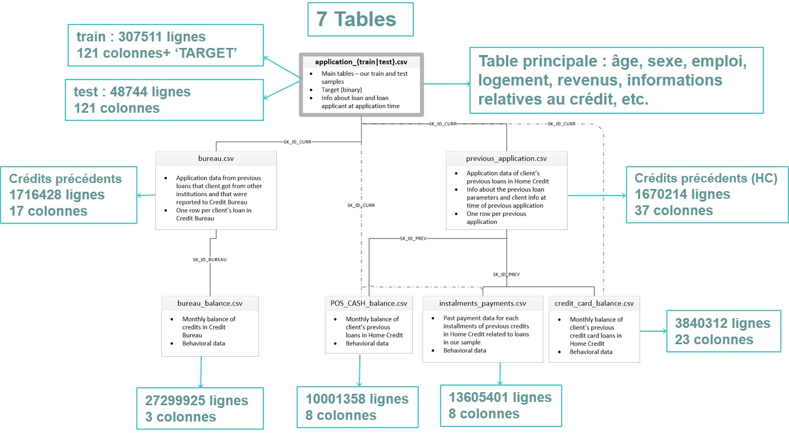

#  Implémentez un modèle de scoring -- crédit bancaire – Home Credit 
#### OpenClassrooms – parcours Data Scientist 
-----
L’entreprise "Prêt à dépenser" souhaite mettre en œuvre un outil de “scoring crédit” pour calculer la probabilité qu’un client rembourse son crédit, puis classifie la demande en crédit accordé ou refusé. Elle souhaite donc développer un algorithme de classification en s’appuyant sur des sources de données variées (données comportementales, données provenant d'autres institutions financières, etc.).

## Mission  
Les missions de ce projet sont :
•	Construire un modèle de scoring qui donnera une prédiction sur la probabilité de faillite d'un client de façon automatique.
•	Construire un dashboard interactif à destination des gestionnaires de la relation clientèle permettant d'interpréter les prédictions faites par le modèle.
## Données
Le jeu de données est issu d’une compétition Kaggle organisée en août 2018 dont l’objectif est de prédire les incidents de paiements dans le cadre de l’octroi de prêts bancaires.  
L'organigramme ci-dessous présente l'ensemble des tables à notre disposition, leur contenu ainsi que les liens qui les relient :
Voici le schéma descriptif des données :   
     

Au total nous avons 10 tables à notre disposition. En plus des 8 tables de l'organigramme ci-dessous (dont 2 application/train/test sont illustrées avec la même table), il y a la table (HomeCredit_columns_description) qui décrit toutes les variables et qui sont 219 au total. La table (sample_submission) illustre le format pour l'envoi des résultats de la compétition 

## Etapes du projet 
Ce projet est découpé en trois parties :
### 1. Partie analyse et modélisation : Notebook_EDA_Modelisation
Ce notebook contient le code de la modélisation du prétraitement des données à la prédiction et les interprétations globales et locales via SHAP : 
•	Analyse descriptive et nettoyage de jeu de données
•	Feature engineering manuel et automatique via feature tools
•	Entrainement et comparaison de plusieurs modèles : Logistic Regression, Random Forest Classifier, XGBoost, LightGBM. 
•	Le déséquilibre des classes est pris en compte dans l’entraînement du modèle via : l'hyperparamètre class_weight = 'balanced', SMOTE (création des données synthétiques à partir des données existantes = oversampling), 
•	Optimisation des hyperparamètres en gridsearch 
•	Fine tuning des hyperparamètres du modèle le plus performant (lightGBM) via hyperopt
•	Les métriques utilisées : 
o	AUC, communément utilisé avec les classifieurs binaires non équilibrés. 
o	 Une métrique métier qui consiste à calculer le gain pour limiter les pertes financières 
•	Interepreatation gloable et locale via SHAP (SHapley Additive exPlanations)
•	Les fonctions utilisées sont disponibles dans le module p7_functions
### 2. Partie API (api-heroku)
•	Réalisé avec Flask et hébergé par Heroku
•	Lien vers l’API sur heroku : https://maychoueib-credit-score-api.herokuapp.com/
•	 L’API contient les end-points suivants pour interagir avec le Dashboard « front-end»:
-	Chargement des numéros des clients et leurs données
-	Prédiction du score et décision 
-	Informations descriptives des clients
-	Les clients similaires (20 plus proches voisins)
-	Interprétation globale et locale (SHAP)
### 3. Partie Dashboard (streamlit_dashboard)
•	Code réalisé avec Streamlit et hébergé sur leur cloud 
•	Lien vers le Dashboard https://maychoueib-p7-dashboard-streamlit-st-dashboard-hlfoen.streamlitapp.com/
•	En appelant l’API, ce Dashboard affiche :
-	Choix d'un numéro de demande dans menu déroulant
-	Décision pour le crédit (accepté ou refusée) et le score sur une jauge
-	Importance globale et locale des caractéristiques dans la décision du modèle
-	Comparaison du client avec d’autres clients au choix dans un menu déroulant, un groupe des clients ou seulement les clients similaires : 

*Case à cocher : Représentation en boxplot des clients selon leur classe (crédit accepté ou rejeté) et place le client selon la couleur de sa classe (rouge ou vert)
Case à cocher : Une analyse bi-variée interactive des caractéristiques à choisir dans 2 listes déroulantes et plaçant le client sur la courbe*

### Lien de vidéo de démonstration : https://www.youtube.com/watch?v=phG7ouM1oGg&ab_channel=maychoueib    
Sources :     
•	[1] Lien téléchargement des données : https://www.kaggle.com/c/home-credit-default-risk/data    
•	[2] Lien Kernel Kaggle utilisé : https://www.kaggle.com/willkoehrsen/start-here-a-gentle-introduction     

